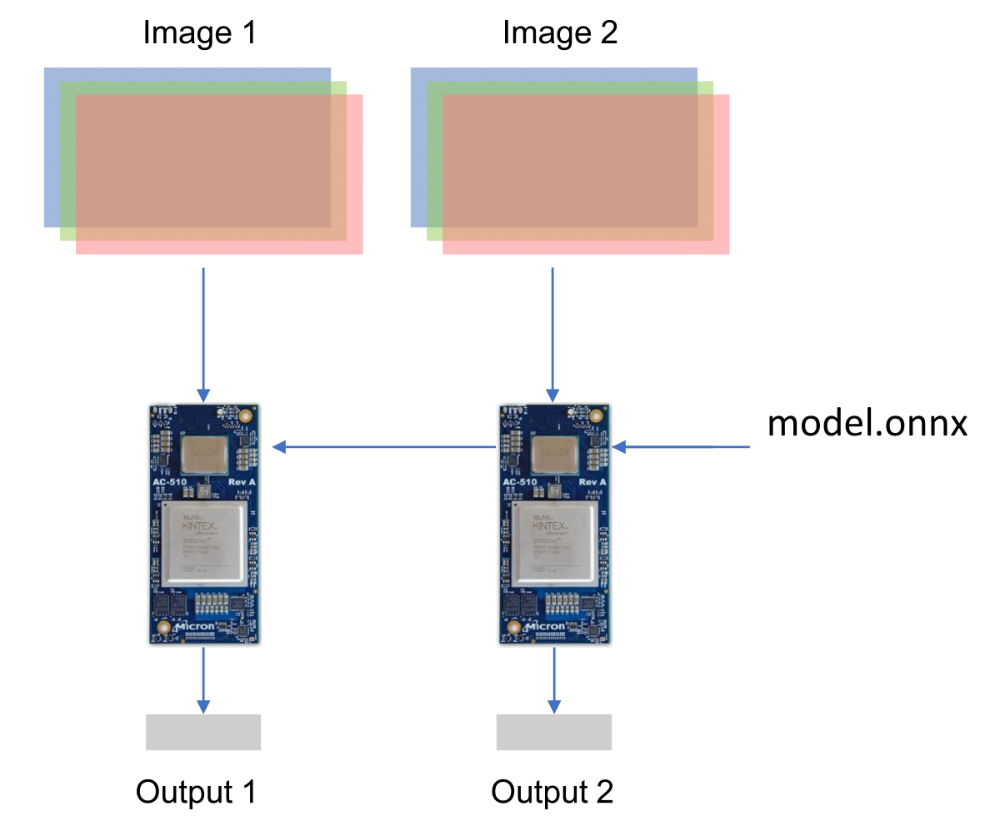
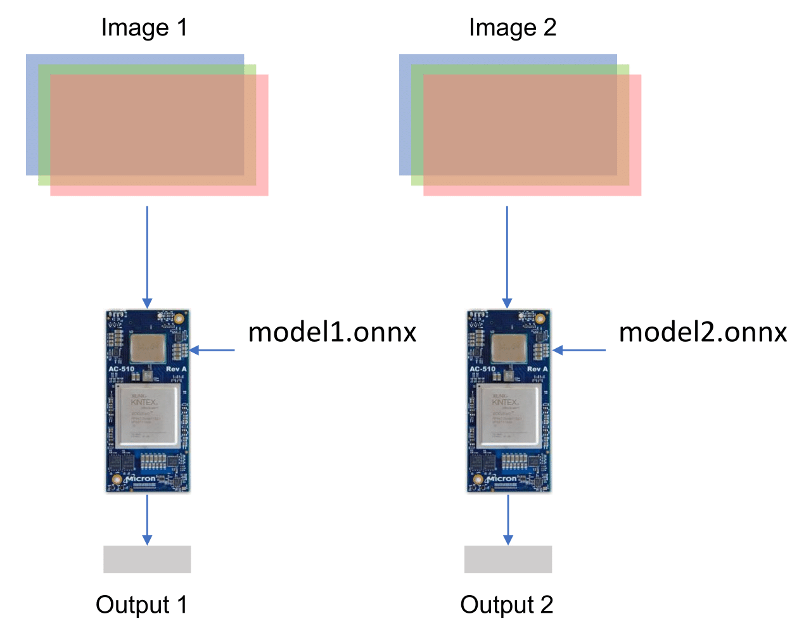
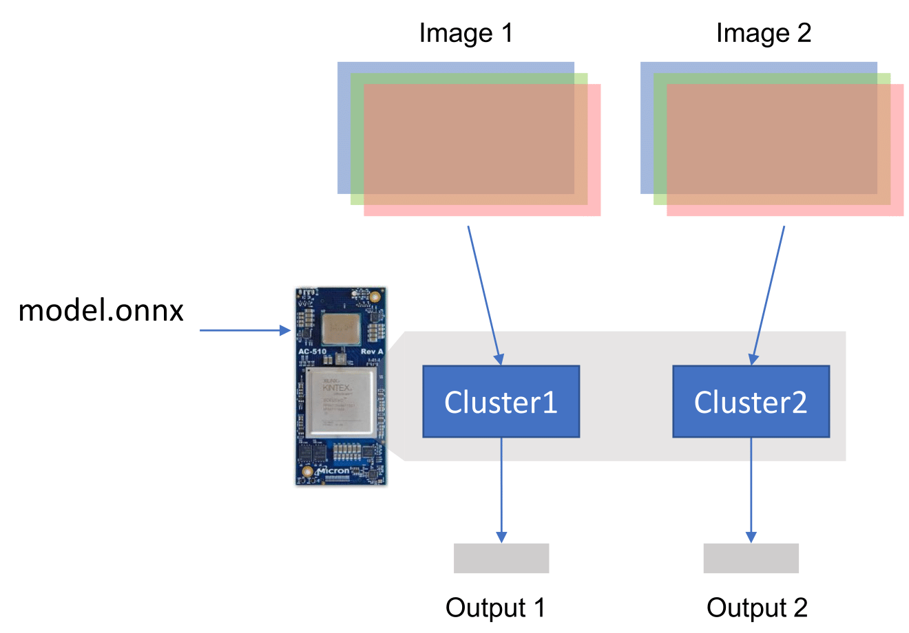
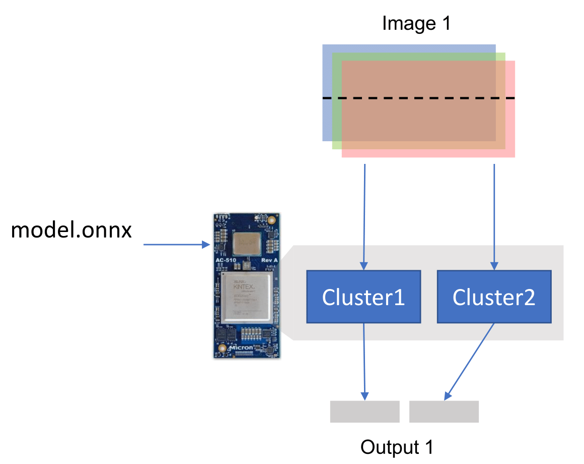
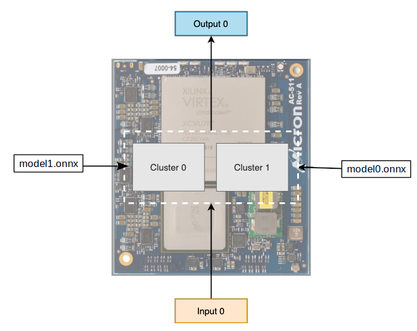
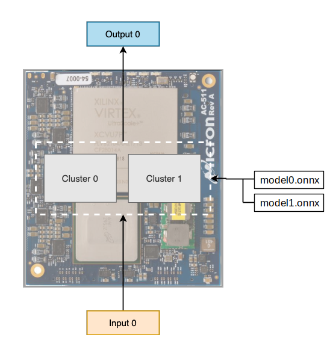

# Micron DLA SDK

Micron DLA Software Developement Kit - SDK

# Micron DLA set-up steps

1. Obtain necessary hardware: This SDK supposes that you are working on a desktop computer with Micron FPGA boards. For example: AC-511 and EX-750.
2. Install pico-computing tools and Micron DLA SDK. Check section [1.](#1-installation)
3. Run a sample example. Check sections [3.](#3-getting-started-inference-on-microndla-hardware) and [4.](#4-getting-started-inference-on-microndla-hardware-with-c)
4. Create your own application

This document provides tutorials and general information about the Micron DLA SDK.

This SDK folder contains:
[**Docker**](docker/): Docker files to create a docker image.

[**Docs**](docs/): Documentation.
* [Python API](docs/PythonAPI.md): Documentation of the python API can be found in docs/PythonAPI.md.
* [C API](docs/C%20API.md): Documentation of the C/C++ API can be found in docs/C API.md.

[**Examples**](examples/): Example code and tests.
* [c_api](examples/c_api): Example how to use the C API
* [pre_trained_models](examples/pre_trained_models): Examples using pre-trained models
* [python_api](examples/python_api): Example how to use the python API
* [tests](examples/tests): Samples to test neural network layers
* [website](examples/website): Example for making a web application with MDLA and Flask

[**Pytorch-torchscript**](torch_mdla/README.md): Tutorial on how to add Micro DLA into pytorch using torchscript.

[**Test-files**](test-files/): Files used for the examples and tutorials.

## Table of Contents:

- [1. Installation](#1-installation) : install SDK
  * [System requirements](#system-requirements)
  * [Pico computing](#pico-computing)
  * [Docker Image](#docker-image)
  * [Python package Install](#python-package-install)
- [2. Getting started with Deep Learning](#2-getting-started-with-deep-learning) : general information about deep learning
  * [Introduction](#introduction)
  * [PyTorch: Deep Learning framework](#pytorch-deep-learning-framework)
  * [My dataset](#my-dataset)
  * [Training a neural network with PyTorch](#training-a-neural-network-with-pytorch)
  * [After training a neural network](#after-training-a-neural-network)
- [3. Getting started Inference on Micron DLA hardware](#3-getting-started-inference-on-micron-dla-hardware) : getting started tutorial for running inference on the DLA
- [4. Getting started Inference on Micron DLA hardware with C](#4-getting-started-inference-on-micron-dla-hardware-with-c) : getting started tutorial for running inference on the DLA using C
- [5. Tutorial - Multiple FPGAs and Clusters](#5-tutorial---multiple-fpgas-and-clusters) : tutorial for running inference on multiple FPGAs and clusters
  * [Multiple FPGAs with input batching <a name="one"></a>](#multiple-fpgas-with-input-batching)
  * [Multiple FPGAs with different models <a name="two"></a>](#multiple-fpgas-with-different-models)
  * [Multiple Clusters with input batching <a name="three"></a>](#multiple-clusters-with-input-batching)
  * [Multiple Clusters without input batching <a name="four"></a>](#multiple-clusters-without-input-batching)
  * [Multiple Clusters with different models <a name="five"></a>](#multiple-clusters-with-different-models)
  * [All Clusters with different models in sequence <a name="six"></a>](#all-clusters-with-different-models-in-sequence)
  * [Multiple Clusters with even bigger batches <a name="seven"></a>](#multiple-clusters-with-even-bigger-batches)
  * [Batching using MVs <a name="four"></a>](#batching-using-mvs)
- [6. Tutorial - PutInput and GetResult](#6-tutorial---putinput-and-getresult) : tutorial for using PutInput and GetOutput
- [7. Tutorial - Writing tests](#7-tutorial---writing-tests) : Tutorial on running tests
- [8. Tutorial - Debugging](#8-tutorial---debugging) : Tutorial on debugging and printing
- [9. Variable Fix Point Quantization](#9-variable-fix-point-quantization) : Tutorial on using variable fix-point
- [10. Running a model from your favorite deep learning framework](#10-running-a-model-from-your-favorite-deep-learning-framework) : Tutorial on converting models to ONNX
  * [Tensorflow](#tensorflow)
  * [Caffe1](#caffe1)
  * [Keras](#keras)
- [11. Supported models and layers](#11-supported-models-and-layers) : List of supported layers and models tested on the DLA
  * [Tested models](#tested-models)
  * [TF-Slim models tested on Micron DLA inference engine](#tf-slim-models-tested-on-microndla-inference-engine)
  * [ONNX model zoo](#onnx-model-zoo)
  * [Keras](#keras)
  * [CNTK](#cntk)
- [12. Troubleshooting and Q&A](#12-troubleshooting-and-qa) : Troubleshooting common issues and answering common questions


# 1. Installation

Request pico-computing installer and docker images in [here](https://picocomputing.zendesk.com/hc/en-us). We will reply your request with the files you need for installation.

Then follow [pico-computing](#pico-computing) installation

## System requirements

This SDK supposes that you are working on a desktop computer with Micron FPGA boards.

Check out this [link](https://www.micron.com/products/advanced-solutions/advanced-computing-solutions) to see what Micron FPGA system you have.

Tested on:
- Ubuntu 18.04 LTS Release, Kernel 4.15.0-39-generic
- CentOS 7.5

Requirements:
- [Pico-computing tools](https://picocomputing.zendesk.com/hc/en-us/): Current version: pico-computing-2020.1. Please verify pico-computing functionality by refering to the document "PicoUsersGuide.pdf" and section "Running a Sample Program"
- [protobuf 3.6.1](https://github.com/google/protobuf/releases/download/v3.6.1/protobuf-all-3.6.1.tar.gz)
- GCC 4.9 or higher
- Python 3
- numpy
- Pillow
- onnx
- torch

## Pico computing

Pico-computing installer package can be requested from this [link](https://picocomputing.zendesk.com/hc/en-us/). To make sure your FPGA system is working properly, install pico-computing tools.

It is highly recommended to read the [UsersGuide](https://picocomputing.zendesk.com/hc/en-us/) to learn about your FPGA system as this SDK uses pico-computing tools.

Pico computing installer will install the SDK together with pico-computing. And `libmicrondla.so` library should be present in `/usr/local/lib/`.

If you have a previous version of pico-computing installed then uninstall it. And remove all `picocomputing-2020.1` and `HMC_release` folders before installing a new version of pico-computing.

After installation, reboot the machine.

To check if pico-computing tools installation was successful, you can run a sample program in `/usr/src/picocomputing-2020.1/samples`.

If there is an issue going through this section, a quick check is to run the following commands. It should print the following outputs for AC511 system.
```
lspci | grep -i pico
    05:00.0 Memory controller: Pico Computing Device 0045 (rev 05)
    08:00.0 Memory controller: Pico Computing Device 0511 (rev 05)
lsmod | grep -i pico
    pico                 3493888  12
```
After installing pico-computing, run install.sh to install the MDLA SDK


## Docker Image 

This step is optinal if you want to run as a docker image

If you want to use MDLA with docker, then you need to install [pico-computing](#pico-computing) and [docker](https://docs.docker.com/get-docker/).

To start a docker with the Micron DLA SDK you can either download prebuilt images or build them yourself. The benefit of custom building the image is that you can adjust the OS packages you want installed at build time. The trade-off is waiting through the build process of about 15-30min (depending on network and CPU speed).

### Load prebuilt Image.
Download the docker image for your OS after requesting it [here](https://picocomputing.zendesk.com/hc/en-us/).

For Ubuntu 18.04:
```
$ docker load < mdla_ubuntu18.04.tgz
```

For CentOS 7.5:
```
$ docker load < mdla_centos7.5.tgz
```
### Build Image with Dockerfile
Copy the OS specific picocomputing package to your docker build folder. Then build and tag the image (we add the latest tag for user convenience when running containers):

For Ubuntu 18.04:
```
$ mkdir docker_build
$ cp /path/to/picocomputing_2020.1_all.deb docker_build
$ cd docker_build
$ docker build -f ../docker/Dockerfile.ubuntu -t micron/mdla:2020.1-ubuntu18.04 -t micron/mdla:latest .
```

For CentOS 7.5:
```
$ mkdir docker_build
$ cp /path/to/picocomputing-2020.1.el6.x86_64.rpm docker_build
$ cd docker_build
$ docker build ../docker/Dockerfile.centos -t micron/mdla:2020.1-centos7.5 -t micron/mdla:latest .
```

### Run Container
Check the tag of the docker image that you just loaded/built using:
```
$ docker images
```

Run the docker image using the `docker run` command:
```
$ docker run -it --rm -v "/path/to/models/on/host":/models --device=/dev/pico1 micron/dla
```
That will start you in the /home/mdla directory where the SDK is preinstalled. The -it flag means interactive, --rm deletes the container on exit, -v mounts a directory into the container, and --device mounts a host device into the container.

To make changes to the container (e.g. install editors, python libraries), remove the --rm flag so the container persists on exit.
You can then use the container id to `docker commit <id>` to a new image or `docker restart <id>` and `docker attach <id>` to reconnect a stopped container. You can also --name the container on run if you prefer not to use ids.
```
$ docker run -it -v "/path/to/models/on/host":/models --device=/dev/pico1 micron/dla
root@d80174ce2995:/home/mdla# exit
$ docker restart d80174ce2995
$ docker attach d80174ce2995
root@d80174ce2995:/home/mdla#
```

Run the example code provided. Check sections [3](#3-getting-started-inference-on-micron-dla-hardware) and [4](#4-getting-started-inference-on-micron-dla-hardware-with-c).

## Python package Install (optional)

You can also install as a python package

`git clone https://github.com/FWDNXT/SDK`

Then inside SDK folder do

`python3 setup.py install --user`


# 2. Getting started with Deep Learning

## Introduction

This is a very concise tutorial to help beginners learn how to create and train a Deep Learning model for use with Micron DLA demonstrations, SDK and other products.

Users should have knowledge of Linux and Ubuntu environments, personal computer or workstation maintenance and command line tools, and experience with the Python programming language. Additionally experience in C, C++, CUDA and GPU programming language may be needed for training advanced modules, but not required at the beginning, as PyTorch offers already implemented functions.


## PyTorch: Deep Learning framework

Micron DLA recommends the use of PyTorch [http://pytorch.org/](http://pytorch.org/) as Deep Learning framework. PyTorch is a CPU and GPU tested and ready framework, allowing users to train small models on CPU and larger and faster models on GPUs. PyTorch also features Dynamic Neural Networks, a version of Autograd - automatic differentiation of computational graphs that can be recorded and played like a tape. All this in simple means that PyTorch offers simpler ways to create custom complex models, and that users will see the benefits of PyTorch when trying to create and debug advanced neural network models.

PyTorch tutorials from beginners to more advanced are linked here: [http://pytorch.org/tutorials/](http://pytorch.org/tutorials/).

## My dataset

We recommend users try to train public models first. Here is a link to some public models and tools for PyTorch: [http://pytorch.org/docs/master/torchvision/datasets.html](http://pytorch.org/docs/master/torchvision/datasets.html).

For image-based datasets, we recommend the folder of folders arrangement: The dataset is a folder DATASET1 and inside there are multiple directory OBJ1, OBJ2, etc, each with multiple image files: obj1-file1.jpg, obj1-file2.png, etc.

## Training a neural network with PyTorch

Training a deep neural network with PyTorch is very simple, and many examples of training scripts: [https://github.com/pytorch/examples](https://github.com/pytorch/examples).

For example, a good starting point is to train Micron DLA supported models on an image classification task. We recommend using this training script:

[https://github.com/pytorch/examples/tree/master/imagenet](https://github.com/pytorch/examples/tree/master/imagenet). This script can load a custom dataset of images, please refer to the requirements in the script README file.

Please make sure that all inputs of the neural network are 32-bit float and are 0-mean and 1-std normalized.

## After training a neural network

After training a neural network with PyTorch, your model is ready for use in Micron DLA SDK. Please refer to the SDK manual for use with MDLA products.


# 3. Getting started Inference on Micron DLA hardware

This tutorial will teach you how to run inference on hardware. We will use a neural network pre-trained on ImageNet.
The program will process an image and return the top-5 classifications of the image. A neural network trained for an object
categorization task will output a probability vector. Each element of the vector contains the probability to its correspondent
category that is listed in a categories file.
In this tutorial you will need:
* One of the [pre-trained models](http://fwdnxt.com/models/)
* [Input image](./test-files): located in /test-files/
* [Categories file](./test-files/categories.txt): located in /test-files/
* [simpledemo.py](./examples/python_api/simpledemo.py): located in /examples/python_api/


**Pytorch and torchvision pretrained model on ImageNet**

In the SDK folder, there is `genonnx.py`. This script will create an ONNX file from [torchvision models](https://github.com/pytorch/vision/tree/master/torchvision).
This utility requires the latest pytorch and it can create an ONNX file from most networks present in the
torchvision package and also from networks in the pth format.

`python3 genonnx.py resnet18`

This command will download a pre-trained alexnet network and create a file called alexnet.onnx

For more information about onnx please visit [https://onnx.ai/](https://onnx.ai/)

To convert tensorflow models into ONNX files please reference the section [6. Using with Tensorflow](#6-using-with-tensorflow)

**Loading the FPGA with MDLA**

When you turn on the system, it will have the FPGA programmed with a default hardware definition. You need to load the MDLA bitfile only once after turning on the system.

You can load a MDLA bitfile of choice using:

`python3 loadbitfile.py <bitfile path>`

You can find the MDLA bitfiles in the pico-computing folder. The default pico-computing installation folder is:

`/usr/src/picocomputing-<version>/samples/InferenceEngine_5/firmware/`

Use the appropriate .tgz file for the system you have.

Loading the FPGA will take at max 5 min.
Loading the FPGA only fails when there are no FPGA cards available. If you find issues in loading FPGA check out [Troubleshooting](#11-troubleshooting-and-qa).
Micron DLA hardware will be loaded in the FPGA card. The following MDLA runs will not need to load the hardware anymore.

**Running inference on Micron DLA hardware for one image**

In the SDK folder, there is simpledemo.py, which is a python demo application.
Its main parts are:

1) Parse the model and generate instructions
2) Get and preprocess input data
3) Init Micron DLA hardware
4) Run Micron DLA hardware
5) Get and display output

The user may modify steps 1 and 5 according to users needs.
Check out other possible application programs using Micron DLA hardware [here](http://fwdnxt.com/).
The example program is located in examples/python_api/

You can run the network on hardware with this command, which will find the FPGA card that was loaded with Micron DLA hardware:

`python3 simpledemo.py <onnx file> <picture> -c <categories file.txt>`

If you used the example image with alexnet, the demo will output:

```
  Doberman, Doberman pinscher 24.4178

  Rottweiler 24.1749

  black-and-tan coonhound 23.6127

  Gordon setter 21.6492

  bloodhound, sleuthhound 19.9336
```


# 4. Getting started Inference on Micron DLA hardware with C

This tutorial will teach you how to run inference on the DLA using C code. We will use a neural network pre-trained on ImageNet.
The program will process an image and return the top-5 classifications of the image.
In this tutorial you will need:
* One of the [pre-trained models](http://fwdnxt.com/models/)
* [Input image](./test-files): located in /test-files/
* [Categories file](./test-files/categories.txt): located in /test-files/
* [Source code](./examples/c_api): located in /examples/c_api/


**Running inference on the DLA for one image**

In the SDK folder, there is compile.c, which compiles an ONNX model and outputs DLA instructions into a .bin file.
The simpledemo.c program will read this .bin file and execute it on the DLA.
The main functions are:
1) `ie_compile`: parse ONNX model and generate the DLA instructions.
2) `ie_init`: load the DLA bitfile into FPGA and load instructions and model parameters to shared memory.
3) `ie_run`: load input image and execute on the DLA.

Check out other possible application programs using the DLA [here](http://fwdnxt.com/).

Make sure the MDLA bitfile was loaded into the FPGA before running it.

To run the demo, first run the following commands:

```
cd <sdk folder>/examples/c_api
make
./compile -m <model.onnx> -i 224x224x3 -o instructions.bin
```
Where `-i` is the input sizes: width x height x channels.
After creating the `instructions.bin`, you can run the network on the DLA with this command, which will find the FPGA card that was loaded with the DLA:

`./simpledemo -i <picturefile> -c <categoriesfile> -s ./instructions.bin`

If you used the example image with alexnet, the demo will output:

```
black-and-tan coonhound -- 23.9883
Rottweiler -- 23.6445
Doberman -- 23.3320
Gordon setter -- 22.0195
bloodhound -- 21.5000
```

# 5. Tutorial - Multiple FPGAs and Clusters

This tutorial will teach you how to run inference on Micron DLA inference engine using multiple FPGAs and clusters.


## Multiple FPGAs with input batching
Suppose that you have a desktop computer with two AC-511 FPGAs cards connected to a EX-750 PCI backplane. To simplify this example, let us assume there is one cluster per FPGA card. We will see how to use multiple clusters in the following sections.
The SDK can receive two images and process one image on each FPGA. The Micron DLA instructions and model parameters are broadcast to each FPGA card's main memory (HMC).
The following code snippet shows you how to do this:

```python
import microndla
import numpy as np
numfpga = 2
numclus = 1
# Create Micron DLA API
sf = microndla.MDLA()
# Generate instructions
sf.SetFlag({'nfpgas': str(numfpga), 'nclusters': str(numclus)})
sf.Compile('resnet18.onnx')
in1 = np.random.rand(2, 3, 224, 224).astype(np.float32)
input_img = np.ascontiguousarray(in1)
# Create a location for the output
output = sf.Run(input_img)
```

`sf.Compile` will parse the model from model.onnx and save the generated Micron DLA instructions. Here numfpga=2, so instructions for two FPGAs are created.
`nresults` is the output size of the model.onnx for one input image (no batching).
The expected output size of `sf.Run` is twice `nresults`, because numfpga=2 and two input images are processed. `input_img` is two images concatenated.
The diagram below shows this type of execution:




## Multiple FPGAs with different models
The SDK can also run different models on different FPGAs. Each `microndla.MDLA()` instance will create a different set of Micron DLA instructions for a different model and load it to a different FPGA.
The following code snippet shows you how to do this:

```python
import microndla
import numpy as np
# Create Micron DLA API
sf1 = microndla.MDLA()
# Create second Micron DLA API
sf2 = microndla.MDLA()
# Generate instructions for model1
sf1.Compile('resnet50.onnx')
# Generate instructions for model2
sf2.Compile('resnet18.onnx')
in1 = np.random.rand(3, 224, 224).astype(np.float32)
in2 = np.random.rand(3, 224, 224).astype(np.float32)
input_img1 = np.ascontiguousarray(in1)
input_img2 = np.ascontiguousarray(in2)
output1 = sf1.Run(input_img1)
output2 = sf2.Run(input_img2)
```

The code is similar to the previous section. Each instance will compile, init and execute a different model on different FPGA.
The diagram below shows this type of execution:



## Multiple Clusters with input batching
For simplicity, now assume you have one FPGA and inside it we have two Micron DLA clusters.
Each cluster can execute its own set of instructions, so we can also batch the input (just like the two FPGA case before).
The difference is that both clusters share the same main memory in the FPGA card. The number of results returned by
Compile() will be the total number of results, for both clusters, in this case.
Following a similar strategy as the two FPGA with input batching example, the following code snippet shows you how to use two clusters to process two images:

```python
import microndla
import numpy as np
numfpga = 1
numclus = 2
# Create Micron DLA API
sf = microndla.MDLA()
# Generate instructions
sf.SetFlag('nclusters', str(numclus))
sf.Compile('resnet18.onnx')
in1 = np.random.rand(2, 3, 224, 224).astype(np.float32)
input_img = np.ascontiguousarray(in1)
output = sf.Run(input_img)
```

The only difference is that nclus=2 and nfpga=1.
The diagram below shows this type of execution:



## Multiple Clusters without input batching
The SDK can also use both clusters on the same input image. It will split the operations among the two clusters.
The following code snippet shows you how to use two clusters to process one image:

```python
import microndla
import numpy as np
numfpga = 1
numclus = 2
# Create Micron DLA API
sf = microndla.MDLA()
sf.SetFlag({'nclusters': str(numclus), 'clustersbatchmode': '1'})
# Generate instructions
sf.Compile('resnet18.onnx')
in1 = np.random.rand(3, 224, 224).astype(np.float32)
input_img = np.ascontiguousarray(in1)
output = sf.Run(input_img)
```

Use `sf.SetFlag('nobatch', '1')` to set the compiler to split the workload among two clusters and generate the instructions.
You can find more information about the option flags [here](docs/Codes.md).
Now the output size is not twice of `nresults` because you expect output for one inference run.
The diagram below shows this type of execution:



## Multiple Clusters with different models
The following example shows how to run different models using different clusters in parallel. 
Currently, a cluster for each model is allowed. But different number of cluster per model is not allowed. For example, 3 clusters for a model and then 1 cluster for another.
The example code is in [here](./examples/python_api/twonetdemo.py)

```python
import microndla
import numpy as np
nclus = 2
img0 = np.random.rand(3, 224, 224).astype(np.float32)
img1 = np.random.rand(3, 224, 224).astype(np.float32)
ie = microndla.MDLA()
ie2 = microndla.MDLA()
ie.SetFlag({'nclusters': nclus, 'clustersbatchmode': 1})
ie2.SetFlag({'nclusters': nclus, 'firstcluster': nclus, 'clustersbatchmode': 1})
ie.Compile('resnet18.onnx')
ie2.Compile('alexnet.onnx', MDLA=ie)
ie.PutInput(img0, None)
ie2.PutInput(img1, None)
result0, _ = ie.GetResult()
result1, _ = ie2.GetResult()
```
In the code, you create one MDLA object for each model and compile them. For the first model, use 2 clusters together. 
For the second model, assign the remaining 2 clusters to it. Use `firstcluster` flag to tell `Compile` which cluster is the first cluster it is going to use.
In this example, first model uses clusters 0 and 1 and second model uses clusters 2 and 3. 
In `Compile`, pass the previous MDLA object to link them together so that they get loaded into memory in one go. 
In this case, you must use `PutInput` and `GetResult` paradigm (this [section](#6-tutorial---putinput-and-getresult)), you cannot use `Run`.



## All Clusters with different models in sequence

This example shows how to load multiple models and run them in a sequence using all clusters. This is similar to previous example, the only different 
all clusters is used for each model. It uses same principle of creating different MDLA objects for each model and link different MDLAs in `Compile`.

```python
import microndla
import numpy as np
nclus = 2
img0 = np.random.rand(3, 224, 224).astype(np.float32)
img1 = np.random.rand(3, 224, 224).astype(np.float32)
ie = microndla.MDLA()
ie2 = microndla.MDLA()
ie.SetFlag({'nclusters': nclus, 'clustersbatchmode': 1})
ie2.SetFlag({'nclusters': nclus, 'clustersbatchmode': 1})
ie.Compile('resnet18.onnx')
ie2.Compile('alexnet.onnx', MDLA=ie)
result0 = ie.Run(img0)
result1 = ie2.Run(img1)
```




## Multiple Clusters with even bigger batches

It's possible to run batches of more than than the number of clusters or FPGAs. Each cluster will process multiple images.
This is enabled with the `imgs_per_cluster` flag. In order to process 32 images, 16 by each cluster, this code will do the work:

```python
import microndla
import numpy as np
numfpga = 1
numclus = 2
# Create Micron DLA API
sf = microndla.MDLA()
sf.SetFlag({'nclusters': str(numclus), 'imgs_per_cluster': '16'})
# Generate instructions
sf.Compile('resnet18.onnx')
in1 = np.random.rand(32, 3, 224, 224).astype(np.float32)
input_img = np.ascontiguousarray(in1)
output = sf.Run(input_img) # Run
```

## Batching using MVs

It's possible to use MV-level parallelism. MV is a computation unit present inside of a cluster and they can be configured to run different images.
This is generally more efficient than leaving different MV units process the same image.
In order to enable this, you have to set the `mvbatch` flag. Keep in mind that this can be only done when `imgs_per_cluster` is a
multiple of 4, since there are 4 MV units available inside of a cluster.

```python
import microndla
import numpy as np
numfpga = 1
numclus = 2
# Create Micron DLA API
sf = microndla.MDLA()
sf.SetFlag({'nclusters': str(numclus), 'imgs_per_cluster': '16', 'mvbatch': '1'})
# Generate instructions
sf.Compile('resnet18.onnx')
in1 = np.random.rand(32, 3, 224, 224).astype(np.float32)
input_img = np.ascontiguousarray(in1)
output = sf.Run(input_img)
```

# 6. Tutorial - PutInput and GetResult
This tutorial teaches you to use PutInput and GetResult API calls.

PutInput will load the input data into the memory that is shared between the host and the Micron DLA.

GetOutput will read the output (results) from the memory. GetOutput can be blocking or non-blocking. Use `SetFlag` function to use blocking or non-blocking mode. The user does not need to care to start the inference engine. PutInput and GetResult will take care of that as soon as the inference engine becomes free.

Blocking means that a call to GetResult will wait for the DLA to finish processing.

Non-blocking means that GetResult will return immediately: with or without the result depending whether the DLA has finished processing.

These two functions are important in a streaming application. The programmer can overlap the time for these two tasks: input loading and getting results.

Some care has to be taken in order to avoid deadlocks. There is only one inference engine and only two internal buffers where input and output are stored. So if a user issues three PutInput in sequence without any GetResult between (or waiting in another thread), the third PutInput will block indefinitely waiting for a buffer to become available, something that will never happen if the user will not call GetResult to get the result of the first PutInput, freeing the associated results buffer. Particular care has to be taken when dealing with multiple inference engine objects: they all share the common hardware, so again there can be only one outstanding PutInput. Consider this sequence:
* PutInput on the first object
* PutInput on the first object
* PutInput on the second object
* GetResult on the second object

This will result in a deadlock, because PutInput on the second object will wait for a buffer to become free and this cannot happen until the user calls GetResult on the first object. Having a thread for each object always waiting for the results, will assure that this will not happen.


Examples using PutInput and GetOutput are located in [examples/python_api/](examples/python_api/).

* pollingdemo.py : is an example of non-blocking mode. The program will poll GetResult until it returns the output.

* interleavingdemo.py : is an example that shows how to pipeline PutInput and GetResult calls. There are two separate memory regions to load inputs and get results. While PutInput loads to one region, GetResult fetches the output from another region. Each image is labeled with the **userobj** to keep track of which input produced the returned output.

* threadeddemo.py : shows how to use two threads to process multiple images in a folder. One thread calls GetResult and another calls PutInput. This is the preferred way to work, as it will give the best possible performance.

* threadedbatchdemo.py : similar to `threadeddemo.py`. It shows how to process images in a batch using PutInput and GetResult.

# 7. Tutorial - Writing tests
This tutorial is going to show you how to create a test.
For this tutorial, we are going to use Pytorch framework.
First, you will need to define a model.
```python
#imports needed for this example
import microndla
import torch
import torch.onnx
import numpy as np

#defines a model with one Convolution layer
class Conv(torch.nn.Module):
    #k: kernel size, s: stride, p: padding
    def __init__(self, inP, outP, k = 3, s = 1, p = 1):
        super(Conv, self).__init__()
        self.op = torch.nn.Conv2d(inP, outP, k, s, p)
    def forward(self, x):
        y = self.op(x)
        return y
```
The purpose of this example test is to show how to run the computation in the accelerator. Thus, we will not train this Conv model for anything. By default, the weights and bias are random values.
You need to create an instance of the model and export it into an onnx file.
```python
w = 16 # input sizes
i = 256 # input planes
o = 256 # output planes
k = 3 # kernel size
s = 1 # stride
p = 0 # padding
# input tensor. Use float32, don't use float16
inV = torch.randn(1, i, w, w, dtype=torch.float32)
# create a model instance
modelConv = Conv(i, o, k, s, p)
# export the model from pytorch to an onnx file
torch.onnx.export(modelConv, inV, "net_conv.onnx")
```

Now we need to run this model using CPU with Pytorch. You can run this model by adding the following:
```python
outhw = modelConv(inV)
result_pyt = outhw.view(-1)
result_pyt = result_pyt.detach().numpy()
```

Now we need to run this model using the accelerator with the SDK.
```python
sf.Compile('net_conv.onnx')
in_1 = np.ascontiguousarray(inV)
result = sf.Run(in_1)
```
The results from the accelerator are in `result` and the results from the CPU are in `result_pyt`. We could print all values of both vectors to compare. A better approach is to have an error metric. The following code calculates the relative mean error and the max error.
```python
error_mean=(np.absolute(result-result_pyt).mean()/np.absolute(result_pyt).max())*100.0
error_max=(np.absolute(result-result_pyt).max()/np.absolute(result_pyt).max())*100.0
print("CONV")
print('Mean/max error compared to pytorch are {:.3f}/{:.3f} %'
.format(error_mean, error_max))
```
The print output for us was:
```python
CONV
Mean/max error compared to pytorch are 1.636/9.055 %
```
Since the input and weights are set randomly, the output might be different from this. In any case, the error is not zero. The results between the CPU and the accelerator do not match. The precision used by the accelerator is fixed point 16bit ([Q8.8](https://en.wikipedia.org/wiki/Fixed-point_arithmetic)) and the CPU uses float32. Thus, a small error is an expected behavior of the accelerator.
The `Init` and `Run` functions internally convert all the float32 values into fix point format.

There are other layers and model that you can test using this method. Additional example tests are in [here](examples/tests).

# 8. Tutorial - Debugging
This tutorial goes through some of the debug functionalities.

Lets use the script we created in the previous tutorial. You can also copy from [here](examples/tests/test_conv.py).

The SDK comes with debug options and compile options. SetFlag function sets these configurations.
You can set a variable directly, such as `SetFlag('nobatch','1')`. Or equivalently, `SetFlag('options', 'C')`.
The `'nobatch'` compile option enables the compiler to spread the computation of each layer across multiple clusters. Since `'nobatch'` is a compile option, we can set it with 'options' and use its option code 'C'.

A debug option won't affect the compiler, it will only print more information. These prints are were used for debugging when developing the compiler, so the prints can have a large amount of information.

You can use `SetFlag('debug', 'b')` to print the basic prints. The debug code `'b'` stands for basic. Debug codes and option codes are letters (case-sensetive). For a complete list of letters refer to [here](docs/Codes.md).

Always put the `SetFlag()` after creating the Micron DLA object. If will print the information about the run. First, it will list all the layers that it is going to compile from the `net_conv.onnx`.

Then `Run` will rearrange in the input tensor and load it into the external memory. It will print the time it took and other properties of the run, such as number of FPGAs and clusters used.

In the `Run` it will start the accelerator. The accelerator uses configuration registers to count how many output values were produced.
The software is going to poll this register until the expected amount of results have been produced by the accelerator.
That is how the software knows that the result is ready in the external memory and it can be fetched to the host.
The "Start card 0 cluster 0" is a print before a while loop that polls that output register. And "Reset card 0 cluster 0" is a print after the while loop exits.

Then profiling for the run will appear afterwards.
The expected bandwidth is calculated as the ratio between data transferred and expected execution time.
data transferred is calculated during compilation. It just counts how many words are send and received between HMC and the accelerator. (This is not between HMC and pcie.)
Expected execution time is also calculated in during compilation. It uses the number of operations, accelerator frequency and number of MACs used to get the expected execution time assuming running at peak performance.
Measured time is measured between start and end of hardware accelerator execution.
Measured bandwidth just uses the measured time instead of expected time in the bandwidth calculation. Eff Measured is the ratio between expected time and measured time.

Then the output is rearranged back to the original data arrangement.

For more details of all the debug options and compile options please refer to [Python API](docs/PythonAPI.md) and [C API](docs/C%20API.md).

Note: `SetFlag('debug', 'w')` will enable warning prints. The warning prints are useful to check if the computation values are overflowing or not. Overflows happen when the result of the computation can't be represented using the fix-point (Q8.8) format.

There are a few suggestions when designing a neural network that will avoid this case.
Check that a batchnorm layer is present after each convolution and linear layer. Another suggestion is to use tanh or sigmoid instead of relu after the layers that have values overflowing.
This will limit the output to -1 and 1 (tanh) or 0 and 1 (sigmoid).


In the example, the layer that is going to be run is printed in the beginning:
```
type conv name=3 id=0 in=(Z1,H16,W16,P256) out=(Z1,H14,W14,P256)
k=(Z1,H3,W3) stride=(Z1,H1,W1) dilation=(Z1,H1,W1)
pad=(Z0,Ze0,T0,B0,R0,L0) opad=(Z0,H0,W0) 0->1
```
The meaning of each part is:
 - type: shows what type is the layer. e.g.: conv, maxpool, concat.
 - name: shows the output name id from onnx. Use [Netron](https://lutzroeder.github.io/netron/) to visualize the onnx model and click on the layer to see the layer's outputs section.
 - id: internal id to reference the layer.
 - in: input sizes. Z1 means on z dimension is size of 1. P256 means on planes dimension is size of 256. H16 means on height size is 16. (or y dimension). W16 means on width size is 16. (or x dimension).
Conv2D have x, y dimensions and channels (W, H, P). Conv3D also have z dimension which is Z (W, H, Z, P).
 - out: output sizes.
 - k: kernel sizes.
 - stride: stride sizes.
 - dilation: dilation sizes.
 - pad: padding sizes. T1: 1 r ow of padding on top. B1: 1 row of padding on bottom. R1: 1 column of padding on right. L1: 1 column of padding on left. Z0: 0 padding along z-dimension. Ze0: 0 padding along z-dimension in the other end
 - opad: output padding sizes.
 - `0->1`: internal indexes to output buffer that connect between different layers.

Example code for running an onnx model is provided [here](examples/tests/test_model.py). It will run and compare the results from Micron DLA and [onnxruntime](https://github.com/microsoft/onnxruntime).
The example takes, path to onnx file and input shape `WxHxP`. It prints the output comparison just like the `test_conv.py` example. You can run it like this:

```
python3 test_model.py resnet18.onnx 224x224x3
```

The code also have a profile option, which will execute each layer of the model and print the time measurements into a `.csv` file.

# 9. Variable Fix Point Quantization

Micro DLA uses 16-bit fix point to represent numbers. The `Compile` function will convert the numbers in the onnx model from float 32-bit into 16-bit fix-point [Q8.8](https://en.wikipedia.org/wiki/Q_(number_format)). The default Micron DLA bitfile will run the model using Q8.8.

A Micron DLA bitfile with variable fix-point support is provided in order to reduce the discrepancy between the float 32-bit and the Q8.8 representation.

This bitfile allows the software to choose different QX.Y representations that is the best fit for different parts of the neural network model.

The SDK provides 2 options for variable fix-point quantization. **Before you try** these options, make sure to load the bitfile that supports variable fix-point into the FPGA.

**Option 1**: For each layer of the model, their weights and biases are converted into different QX.Y representations.

In this case, you can set 'V' in the options using `SetFlag` function before `Compile`:

```python
ie = microndla.MDLA()
ie.SetFlag('varfp', '1')
#Compile to a file
swnresults = ie.Compile('resnet18.onnx')
```

**Option 2**: Variable fix-point can be determined for input and output of each layer if one or more sample inputs are provided.

You will need to provide a set of sample inputs (calibration data) to `Compile` funtion. In addition to compiling the model, `Compile` will run the model with the calibration inputs using float32 and save the variable fix-point configuration for each input/output of each layer in the model. `Compile` will also convert the static data (weights and biases) to the appropriate fix-point representation, so no need for `ie.SetFlag('varfp', '1')` in this case.

Instead of using ie.Compile, you use `Quantize` and give an array of input data:

```python
#Load image into a numpy array
img = LoadImage(args.image, args)
imgs = []
for fn in os.listdir(args.imagesdir):
    x = LoadImage(args.imagesdir + '/' + fn, args)
    imgs.append(x)

#Create and initialize the Inference Engine object
ie = microndla.MDLA()
#Compile to a file
swnresults = ie.Compile('resnet18.onnx', samples=imgs)
```

After that, `Init` and `Run` runs as usual using the saved variable fix-point configuration.

Checkout the example [quantize.py](examples/python_api/quantize.py) which takes same arguments as `simpledemo.py`. The only addition is a folder with the calibration input images for calibration data.

# 10. Running a model from your favorite deep learning framework

Micron DLA supports different deep learning frameworks by running models in ONNX format. In order to convert a model from your favorite deep learning framework to ONNX format you should follow the instructions [here](https://github.com/onnx/tutorials). However there are some extra steps you should take with certain frameworks for the best compatibility with Micron DLA and we describe them below.

There is a list of tutorials on how to convert model to ONNX for each framework in the [ONNX github](https://github.com/onnx/tutorials).

## Tensorflow

To convert tensorflow models into ONNX format, you will need to install [tensorflow-onnx](https://github.com/onnx/tensorflow-onnx).

Tensorflow uses various file formats to represent a model: checkpoint files, frozen graphs (graph with weights) and saved_model. For more details please refer to [tensorflow guides](https://www.tensorflow.org/guide/extend/model_files).

The simplest way is to save the model in the saved_model.pb, as our SDK will automatically call tensorflow-onnx to convert it to ONNX. Just pass the directory with the saved_model.pb file to Compile. Otherwise follow the instructions of tensorflow-onnx to convert the tensorflow model to ONNX.

For example, you can take the basic example from the [basic Tensorflow tutorial](https://www.tensorflow.org/overview)

```
import tensorflow as tf
mnist = tf.keras.datasets.mnist

(x_train, y_train),(x_test, y_test) = mnist.load_data()
x_train, x_test = x_train / 255.0, x_test / 255.0

model = tf.keras.models.Sequential([
  tf.keras.layers.Flatten(input_shape=(28, 28)),
  tf.keras.layers.Dense(128, activation='relu'),
  tf.keras.layers.Dropout(0.2),
  tf.keras.layers.Dense(10, activation='softmax')
])

model.compile(optimizer='adam',
              loss='sparse_categorical_crossentropy',
              metrics=['accuracy'])

model.fit(x_train, y_train, epochs=5)
model.evaluate(x_test, y_test)
model.save('mnist')
```

and then try with our inference engine:

```
import microndla
import numpy as np
import tensorflow as tf
mnist = tf.keras.datasets.mnist

(x_train, y_train),(x_test, y_test) = mnist.load_data()
x_train, x_test = x_train / 255.0, x_test / 255.0

ie = microndla.MDLA()
ie.Compile('mnist.onnx')
for i in range(0, 10):
    result = ie.Run(x_test[i].astype(np.float32))
    print(y_test[i], np.argmax(result))

```

## Caffe1

**Step 0 (optional):** Make sure your model is in the newest Caffe1 format. If not use upgrade_net_proto_text binary from Caffe1 tools to upgrade it. For example to upgrade VGG-16 from Caffe1 model zoo:

`upgrade_net_proto_text VGG_ILSVRC_16_layers_deploy.prototxt vgg16_caffe1.prototxt`

**Step 1:** Download [caffe_translator.py](https://github.com/pytorch/pytorch/blob/master/caffe2/python/caffe_translator.py). Use it to convert model from Caffe1 format to Caffe2. For example:

`python caffe_translator.py vgg16_caffe1.prototxt VGG_ILSVRC_16_layers.caffemodel`

**Step 2:** Now your model is in Caffe2 format. You can follow the [official instructions](https://github.com/onnx/tutorials/blob/master/tutorials/Caffe2OnnxExport.ipynb) to convert it to ONNX format. Example conversion:

`convert-caffe2-to-onnx predict_net.pb --caffe2-init-net init_net.pb --value-info '{"data": [1, [1, 3, 224, 224]]}' -o vgg16.onnx`

For more information see links below:

[https://github.com/BVLC/caffe/blob/master/tools/upgrade_net_proto_text.cpp](https://github.com/BVLC/caffe/blob/master/tools/upgrade_net_proto_text.cpp)

[https://caffe2.ai/docs/caffe-migration.html](https://caffe2.ai/docs/caffe-migration.html)

## Keras

Exporting Keras models to ONNX format is done through [ONNXMLTools](https://github.com/onnx/onnxmltools). You should edit ~/.keras/keras.json so that field "image_data_format" is set to "channels_first". A sample code to convert Resnet 50 from Keras to ONNX is shown below.

```python
import onnx
import onnxmltools
import keras

model = keras.applications.resnet50.ResNet50(include_top=True, weights='imagenet',
input_tensor=None, input_shape=None, pooling=None, classes=1000)
onnx_model = onnxmltools.convert_keras(model)
onnx.save(onnx_model, 'resnet50.onnx')
```

# 11. Supported models and layers

  * [Add](examples/tests/test_vectoradd.py)
  * AveragePool
  * BatchNormalization
  * Concat
  * [Conv](examples/tests/test_conv.py)
  * [ConvTranspose](examples/tests/test_transconv.py)
  * GlobalAveragePool
  * LeakyRelu
  * [Linear](examples/tests/test_matrixvector.py)
  * [MaxPool](examples/tests/test_maxpool.py)
  * [Mul](examples/tests/test_vectormul.py)
  * Relu
  * Sigmoid
  * Tanh
  * Upsample

## Tested models

  * Alexnet OWT (versions without LRN)
  * Resnet 18, 34, 50
  * Inception v1, v3
  * VGG 16, 19
  * [LightCNN-9](https://arxiv.org/pdf/1511.02683.pdf)
  * [Linknet](https://arxiv.org/pdf/1707.03718.pdf)
  * [Neural Style Transfer Network](https://arxiv.org/pdf/1603.08155.pdf)
  * LSTM
  * GRU
  * [Mobilenet](https://github.com/onnx/models/blob/master/vision/classification/mobilenet/model/mobilenetv2-7.onnx)
  * [Linknet](https://arxiv.org/abs/1707.03718)
  * [Enet](https://arxiv.org/abs/1606.02147)
  * [SqueezeNet](https://arxiv.org/abs/1602.07360)

## TF-Slim models tested on Micron DLA inference engine

* Inception V1
* Inception V3
* ResNet V1 50
* VGG 16
* VGG 19

## ONNX model zoo

https://github.com/onnx/models

 * Resnet v1 all models work, Resnet v2 not yet
 * Squeezenet
 * VGG all models
 * Emotion FerPlus
 * MNIST

Note: BVLC models, Inception_v1, ZFNet512 are not supported because we do not support the LRN layer.

## Keras

* [ResNet50](https://keras.io/applications/#resnet50)

## CNTK

* [ResNet50](https://www.cntk.ai/Models/CNTK_Pretrained/ResNet50_ImageNet_CNTK.model)
* [VGG16](https://www.cntk.ai/Models/Caffe_Converted/VGG16_ImageNet_Caffe.model)

# 12. Troubleshooting and Q&A

Q: Where can I find weights for pretrained TF-slim models?

A: They can be found as tarred checkpoint files at

[https://github.com/tensorflow/models/tree/master/research/slim#Pretrained](https://github.com/tensorflow/models/tree/master/research/slim#Pretrained)

Q: Issue: Can't find FPGA card

A: Make sure the picocomputing release is installed properly. Please run the following commands. It should print the following outputs.
```
lspci | grep -i pico
    05:00.0 Memory controller: Pico Computing Device 0045 (rev 05)
    08:00.0 Memory controller: Pico Computing Device 0510 (rev 05)
lsmod | grep -i pico
    pico                 3493888  12
```

Q: Can I run my own model?

A: yes, all models that are derivatives of the ones listed in the Supported Networks section. It can be modified within the limitations of the system.

Q: How will developers be able to develop on your platform?

A: They will need to provide a neural network model only. No need to write any special code. Micron DLA will update the software periodically based on users and market needs.

Q: What tools will I need at minimum?

A: Micron DLA inference engine on an FPGA and Micron DLA SDK tools
