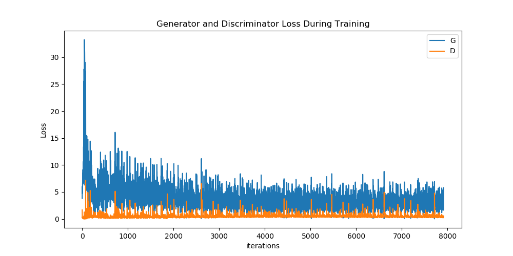

# DCGAN Tutorial

This tutorial uses contents from [Pytorch's DCGAN Tutorial](https://pytorch.org/tutorials/beginner/dcgan_faces_tutorial.html).

This tutorial shows an example of the entire workflow from creating a neural network to running it on the accelerator.
You are going to learn how to:

1. Create a model
2. Train this model for generating faces
3. Export the trained model to ONNX
4. Run the model on the accelerator

## Training script
We need to write code for to train the model that we are going to create.

Before we begin, lets call imports and define variables for the code.
```python
from __future__ import print_function
#%matplotlib inline
import argparse
import os
import random
import torch
import torch.nn as nn
import torch.nn.parallel
import torch.backends.cudnn as cudnn
import torch.optim as optim
import torch.utils.data
import torchvision.datasets as dset
import torchvision.transforms as transforms
import torchvision.utils as vutils
import numpy as np
import matplotlib.pyplot as plt
import matplotlib.animation as animation
from IPython.display import HTML

# Set random seem for reproducibility
manualSeed = 999
#manualSeed = random.randint(1, 10000) # use if you want new results
print("Random Seed: ", manualSeed)
random.seed(manualSeed)
torch.manual_seed(manualSeed)

dataroot = "celeba" # Root directory for dataset

workers = 2 # Number of workers for dataloader

batch_size = 128 # Batch size during training

image_size = 64 # Spatial size of training images. All images will be resized to this size using a transformer.

nc = 3 # Number of channels in the training images. For color images this is 3

nz = 100 # Size of z latent vector (i.e. size of generator input)

ngf = 64 # Size of feature maps in generator

ndf = 64 # Size of feature maps in discriminator

num_epochs = 5 # Number of training epochs

lr = 0.0002 # Learning rate for optimizers

beta1 = 0.5 # Beta1 hyperparam for Adam optimizers

ngpu = 1 # Number of GPUs available. Use 0 for CPU mode.
```

## Dataset

Same as in Pytorch tutorial, we are going to use [Celeb-A Faces](http://mmlab.ie.cuhk.edu.hk/projects/CelebA.html) dataset which can be downloaded at the linked site, or in [Google Drive](https://drive.google.com/drive/folders/0B7EVK8r0v71pTUZsaXdaSnZBZzg).

You should have `img_align_celeba.zip`. Create a directory named `celeba` and extract the zip file into that directory. Make sure the `dataroot` variable is set to the path of `celeba` folder.

Then you will need to create the dataloader, which is just a way to handle the data. You can use the code from the Pytorch tutorial.

```python
# We can use an image folder dataset the way we have it setup.
# Create the dataset
dataset = dset.ImageFolder(root=dataroot,
                           transform=transforms.Compose([
                               transforms.Resize(image_size),
                               transforms.CenterCrop(image_size),
                               transforms.ToTensor(),
                               transforms.Normalize((0.5, 0.5, 0.5), (0.5, 0.5, 0.5)),
                           ]))
# Create the dataloader
dataloader = torch.utils.data.DataLoader(dataset, batch_size=batch_size,
                                         shuffle=True, num_workers=workers)

# Decide which device we want to run on
device = torch.device("cuda:0" if (torch.cuda.is_available() and ngpu > 0) else "cpu")
```
You can use GPU to run your training script to make it faster. If you dont have GPU, it is fine to train on CPU.

## Define model
Now, we need to define the model. It is composed of 2 parts: Generator and Discriminator.
The big picture is that Discriminator tries to classify the input image, and the Generator generates an image to fool the Discriminator.

```python
# Generator
class Generator(nn.Module):
    def __init__(self, ngpu):
        super(Generator, self).__init__()
        self.ngpu = ngpu
        self.main = nn.Sequential(
            # input is Z, going into a convolution
            nn.ConvTranspose2d( nz, ngf * 6, 4, 1, 0, bias=False),
            nn.BatchNorm2d(ngf * 6),
            nn.ReLU(True),
            # state size. (ngf*6) x 4 x 4
            nn.ConvTranspose2d(ngf * 6, ngf * 4, 4, 2, 1, bias=False),
            nn.BatchNorm2d(ngf * 4),
            nn.ReLU(True),
            # state size. (ngf*4) x 8 x 8
            nn.ConvTranspose2d( ngf * 4, ngf * 2, 4, 2, 1, bias=False),
            nn.BatchNorm2d(ngf * 2),
            nn.ReLU(True),
            # state size. (ngf*2) x 16 x 16
            nn.ConvTranspose2d( ngf * 2, ngf, 4, 2, 1, bias=False),
            nn.BatchNorm2d(ngf),
            nn.ReLU(True),
            # state size. (ngf) x 32 x 32
            nn.ConvTranspose2d( ngf, nc, 4, 2, 1, bias=False),
            nn.Tanh()
            # state size. (nc) x 64 x 64
        )

    def forward(self, input):
        return self.main(input)

#Discriminator
class Discriminator(nn.Module):
    def __init__(self, ngpu):
        super(Discriminator, self).__init__()
        self.ngpu = ngpu
        self.main = nn.Sequential(
            # input is (nc) x 64 x 64
            nn.Conv2d(nc, ndf, 4, 2, 1, bias=False),
            nn.ReLU(),
            # state size. (ndf) x 32 x 32
            nn.Conv2d(ndf, ndf * 2, 4, 2, 1, bias=False),
            nn.BatchNorm2d(ndf * 2),
            nn.ReLU(),
            # state size. (ndf*2) x 16 x 16
            nn.Conv2d(ndf * 2, ndf * 4, 4, 2, 1, bias=False),
            nn.BatchNorm2d(ndf * 4),
            nn.ReLU(),
            # state size. (ndf*4) x 8 x 8
            nn.Conv2d(ndf * 4, ndf * 8, 4, 2, 1, bias=False),
            nn.BatchNorm2d(ndf * 8),
            nn.ReLU(),
            # state size. (ndf*8) x 4 x 4
            nn.Conv2d(ndf * 8, 1, 4, 1, 0, bias=False),
            nn.Sigmoid()
        )

    def forward(self, input):
        return self.main(input)
```
You can change the layers arguments or try a different model architecture.

Create a function to initialize the weights of the model.

```python
# custom weights initialization called on netG and netD
def weights_init(m):
    classname = m.__class__.__name__
    if classname.find('Conv') != -1:
        nn.init.normal_(m.weight.data, 0.0, 0.02)
    elif classname.find('BatchNorm') != -1:
        nn.init.normal_(m.weight.data, 1.0, 0.02)
        nn.init.constant_(m.bias.data, 0)
```

Now, you need to create the model instance and initialize the weights.

```python
# Create the generator
netG = Generator(ngpu).to(device)

# Handle multi-gpu if desired
if (device.type == 'cuda') and (ngpu > 1):
    netG = nn.DataParallel(netG, list(range(ngpu)))

# Apply the weights_init function to randomly initialize all weights to mean=0, stdev=0.2.
netG.apply(weights_init)

# Create the Discriminator
netD = Discriminator(ngpu).to(device)

# Handle multi-gpu if desired
if (device.type == 'cuda') and (ngpu > 1):
    netD = nn.DataParallel(netD, list(range(ngpu)))

# Apply the weights_init function to randomly initialize all weights to mean=0, stdev=0.2.
netD.apply(weights_init)
```

## Traning loop

Now, we need to write the training loop. First, lets define the loss function, which basically gives you a metric of how well your model is doing.

We need 2 metrics: one of how well the Discriminator is classifying the images and another for how well the Generator is fooling the discriminator.

```python
# Initialize BCELoss function
criterion = nn.BCELoss()

# Create batch of latent vectors that we will use to visualize
#  the progression of the generator
fixed_noise = torch.randn(64, nz, 1, 1, device=device)

# Establish convention for real and fake labels during training
real_label = 1
fake_label = 0

# Setup Adam optimizers for both G and D
optimizerD = optim.Adam(netD.parameters(), lr=lr, betas=(beta1, 0.999))
optimizerG = optim.Adam(netG.parameters(), lr=lr, betas=(beta1, 0.999))
```

Now, we need to write a training loop, in which the weights of both models are going to be tunned for the `celeb` dataset.

```python
# Training Loop

# Lists to keep track of progress
img_list = []
G_losses = []
D_losses = []
iters = 0

print("Starting Training Loop...")
# For each epoch
for epoch in range(num_epochs):
    # For each batch in the dataloader
    for i, data in enumerate(dataloader, 0):

        # (1) Update D network: maximize log(D(x)) + log(1 - D(G(z)))
        # Train with all-real batch
        netD.zero_grad()
        # Format batch
        real_cpu = data[0].to(device)
        b_size = real_cpu.size(0)
        label = torch.full((b_size,), real_label, device=device)
        # Forward pass real batch through D
        output = netD(real_cpu).view(-1)
        # Calculate loss on all-real batch
        errD_real = criterion(output, label)
        # Calculate gradients for D in backward pass
        errD_real.backward()
        D_x = output.mean().item()

        # Train with all-fake batch
        # Generate batch of latent vectors
        noise = torch.randn(b_size, nz, 1, 1, device=device)
        # Generate fake image batch with G
        fake = netG(noise)
        label.fill_(fake_label)
        # Classify all fake batch with D
        output = netD(fake.detach()).view(-1)
        # Calculate D's loss on the all-fake batch
        errD_fake = criterion(output, label)
        # Calculate the gradients for this batch
        errD_fake.backward()
        D_G_z1 = output.mean().item()
        # Add the gradients from the all-real and all-fake batches
        errD = errD_real + errD_fake
        # Update D
        optimizerD.step()

        # (2) Update G network: maximize log(D(G(z)))
        netG.zero_grad()
        label.fill_(real_label)  # fake labels are real for generator cost
        # Since we just updated D, perform another forward pass of all-fake batch through D
        output = netD(fake).view(-1)
        # Calculate G's loss based on this output
        errG = criterion(output, label)
        # Calculate gradients for G
        errG.backward()
        D_G_z2 = output.mean().item()
        # Update G
        optimizerG.step()

        # Output training stats
        if i % 50 == 0:
            print('[%d/%d][%d/%d]\tLoss_D: %.4f\tLoss_G: %.4f\tD(x): %.4f\tD(G(z)): %.4f / %.4f'
                  % (epoch, num_epochs, i, len(dataloader),
                     errD.item(), errG.item(), D_x, D_G_z1, D_G_z2))

        # Save Losses for plotting later
        G_losses.append(errG.item())
        D_losses.append(errD.item())

        # Check how the generator is doing by saving G's output on fixed_noise
        if (iters % 500 == 0) or ((epoch == num_epochs-1) and (i == len(dataloader)-1)):
            with torch.no_grad():
                fake = netG(fixed_noise).detach().cpu()
            img_list.append(vutils.make_grid(fake, padding=2, normalize=True))
        iters += 1

#save checkpoint
torch.save({
'discriminator':netD.state_dict,
'generator':netG.state_dict,
'optimizerD':optimizerD,
'optimizerG':optimizerG
},'dcgan_epoch.pth')
```
At the end of the training loop, we save the trained model into a `.pth` file.

To check our trained model, we can run plot the Loss and some outputs from the Generator.

```python
plt.figure(figsize=(10,5))
plt.title("Generator and Discriminator Loss During Training")
plt.plot(G_losses,label="G")
plt.plot(D_losses,label="D")
plt.xlabel("iterations")
plt.ylabel("Loss")
plt.legend()
plt.show()

fig = plt.figure(figsize=(8,8))
plt.axis("off")
ims = [[plt.imshow(np.transpose(i,(1,2,0)), animated=True)] for i in img_list]
ani = animation.ArtistAnimation(fig, ims, interval=1000, repeat_delay=1000, blit=True)

HTML(ani.to_jshtml())

# Grab a batch of real images from the dataloader
real_batch = next(iter(dataloader))

# Plot the real images
plt.figure(figsize=(15,15))
plt.subplot(1,2,1)
plt.axis("off")
plt.title("Real Images")
plt.imshow(np.transpose(vutils.make_grid(real_batch[0].to(device)[:64], padding=5, normalize=True).cpu(),(1,2,0)))

# Plot the fake images from the last epoch
plt.subplot(1,2,2)
plt.axis("off")
plt.title("Fake Images")
plt.imshow(np.transpose(img_list[-1],(1,2,0)))
plt.show()
```
This program will train your model for many iterations over the entire dataset. On the pico-mini PC, it took approximately 5 hours to finish.

We provide the trained `.pth` and `.onnx` files [here](http://fwdnxt.com/models/) if you don't want to wait for training.

Once it finishes it will plot the Loss graph and some sample images generated by your model. The Loss graph that we got was:



Until now all the code above was from [Pytorch's DCGAN Tutorial](https://pytorch.org/tutorials/beginner/dcgan_faces_tutorial.html).

The tutorial code was copied for educational and training purposes.

## Export to ONNX
Now that we have a trained model, we need to export it into ONNX format, which is a popular Neural Network exchange format.
Look here for more details about [ONNX](https://github.com/onnx/onnx).

Add the following line at the end of the training script.
```python
img = torch.FloatTensor(1, 100, 1, 1)
# img = torch.FloatTensor(1, 100, 1, 1).cuda() # use this if you trained with GPU
torch.onnx.export(netG, img, 'generator.onnx')
```

You can also load the `.pth` file again and then call `torch.onnx.export` again.

[Pytorch's Saving and Loading Models](https://pytorch.org/tutorials/beginner/saving_loading_models.html) is a good tutorial about saving and loading models in Pytorch.


## Run on accelerator
We are going to run the Generator to print out some imaginary faces.

```python
import microndla
import sys
import numpy as np
import torch
import torchvision.utils as vutils

bitfile = "" # add bitfile path to load bitfile into FPGA
ie = microndla.MDLA()
print('Compile')
outsz = ie.Compile("1x1x100","generator.onnx","dcgan.bin")
print('Init')
osz = ie.Init("save.bin", bitfile)
print('Run')
inp = torch.randn(1,100,1,1).numpy()
out = np.ndarray(outsz,dtype=np.float32)
ie.Run(inp, out)

out_frame = out.reshape(1,3,64,64)
fake = torch.from_numpy(out_frame)
vutils.save_image(fake, 'out.png', normalize=True)
```

`ie.Compile` reads the ONNX file and generates instructions for the accelerator. It also quantizes the weight values into 16-bit fix point precision.
This function outputs `dcgan.bin` file that contains instructions and quantized weights.

`ie.Init` will initialize the FPGA and send the data to external memory that is shared between host and accelerator.

`ie.Run` will run the accelerator. The output image should be saved in `out.png`.

The image we got it this:


You can training other models for other tasks, export it and run it using the accelerator just like you did here.

The full code of this tutorial is in this folder.

